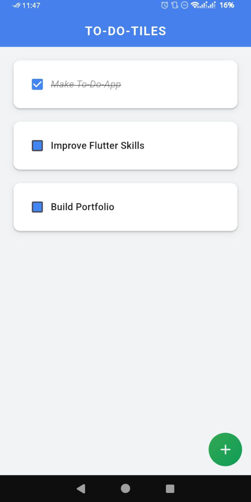
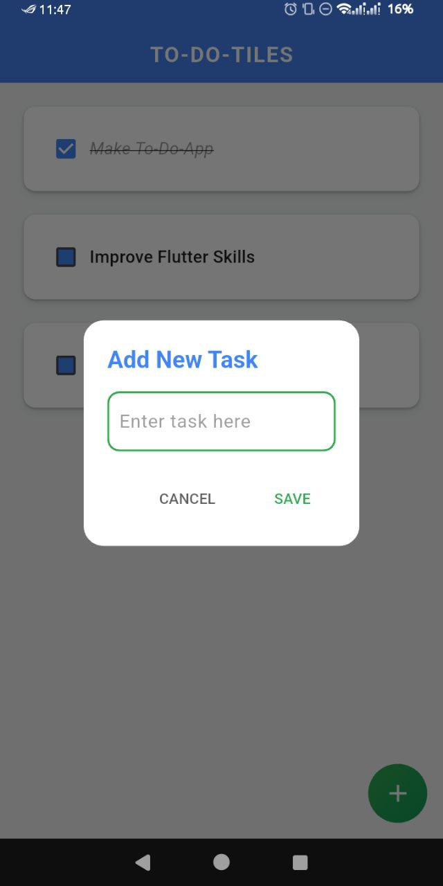

# 📝 Flutter To-Do App

A beautiful and simple To-Do list app built with Flutter and Hive. Easily add, check off, and delete tasks with a clean UI and smooth user experience.

---

## 📱 Screenshots

### 🏠 Home Screen


### ➕ Add Task Dialog


### ❌ Delete Confirmation


---

## ✨ Features

- 🧠 Add tasks with a modern dialog
- ✅ Mark tasks as completed
- 🗑️ Delete tasks with confirmation
- 🎨 Clean UI with Google-style colors
- 💾 Offline storage using Hive
- 📜 Automatically scrolls to the latest task

---

## 🚀 Getting Started

1. Clone the repository:
   ```bash
   git clone https://github.com/sutoji5/flutter-todo-app.git


2. Navigate to the project directory:
     cd to_do_app
   
3. Install dependencies:
     flutter pub get
  
4. Run the app:
     flutter run


🧰 Built With

     Flutter

     Hive

     Slidable

💡 Folder Structure

lib/
├── colors/             # Custom theme colors
├── data/               # Hive database logic
├── util/               # Reusable widgets (Dialog, Tile, etc.)
└── main.dart           # Entry point

📄 License
This project is open-source and available under the MIT License.

🙌 Author
Kaung Myat Thu
 
 HEAD
GitHub: @sutoji5

GitHub: @sutoji5
 5f216eb474efa861b5adb285559ae50bcc00e680
