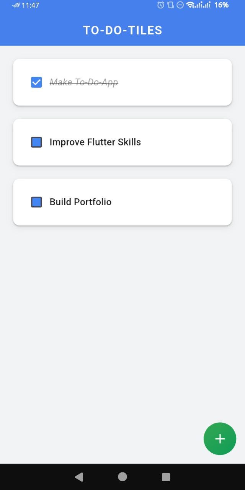
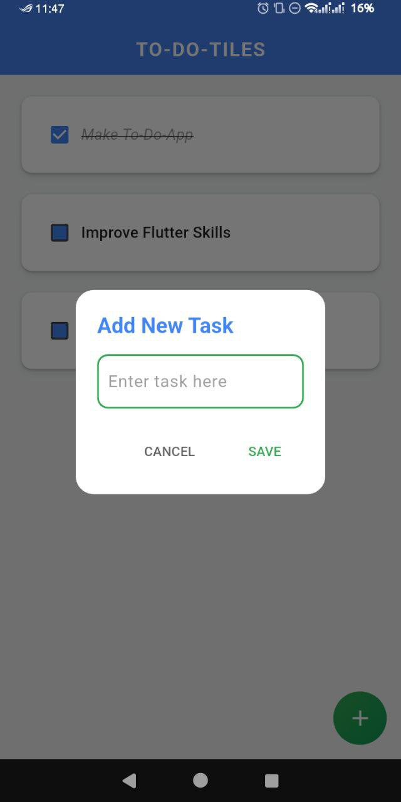
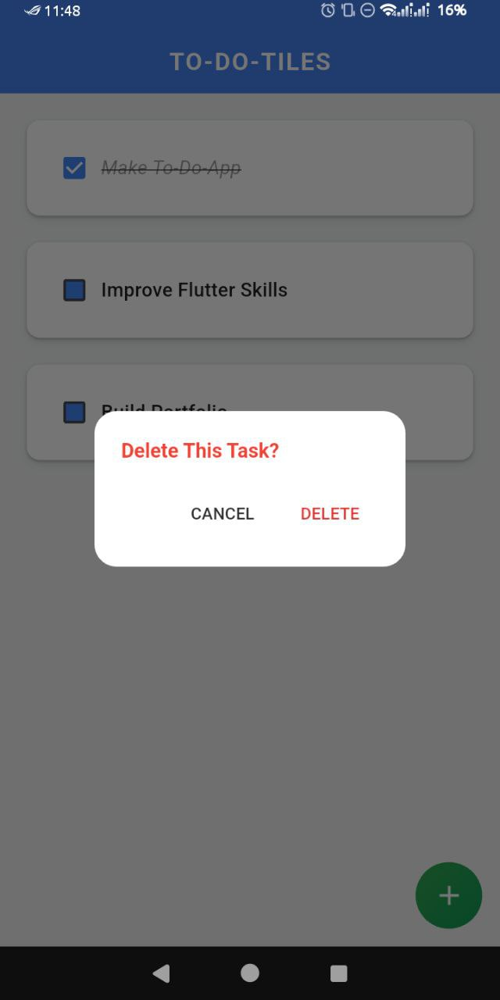

# Flutter To-Do App

A simple To-Do list app built with Flutter and Hive. Easily add, check off, and delete tasks.

---

##  Screenshots

###  Home Screen

###  Add Task Dialog

###  Delete Confirmation

---

##  Features

-  Add tasks with a modern dialog
-  Mark tasks as completed
-  Delete tasks with confirmation
-  Clean UI with Google-style colors
-  Offline storage using Hive
-  Automatically scrolls to the latest task

---

 Folder Structure

lib/
├── colors/             # Custom theme colors
├── data/               # Hive database logic
├── util/               # Reusable widgets (Dialog, Tile, etc.)
└── main.dart           # Entry point

GitHub: @sutoji5
 5f216eb474efa861b5adb285559ae50bcc00e680
